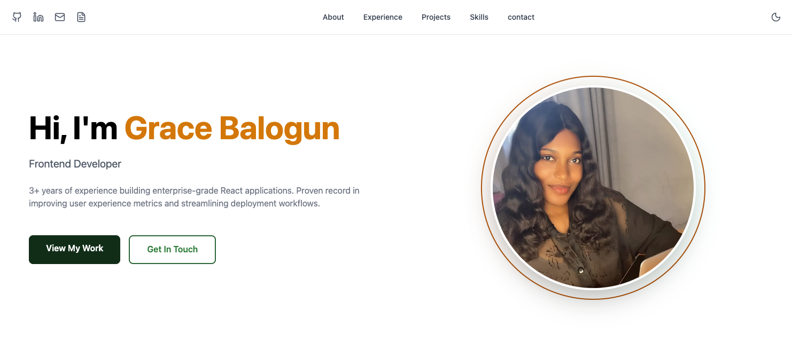
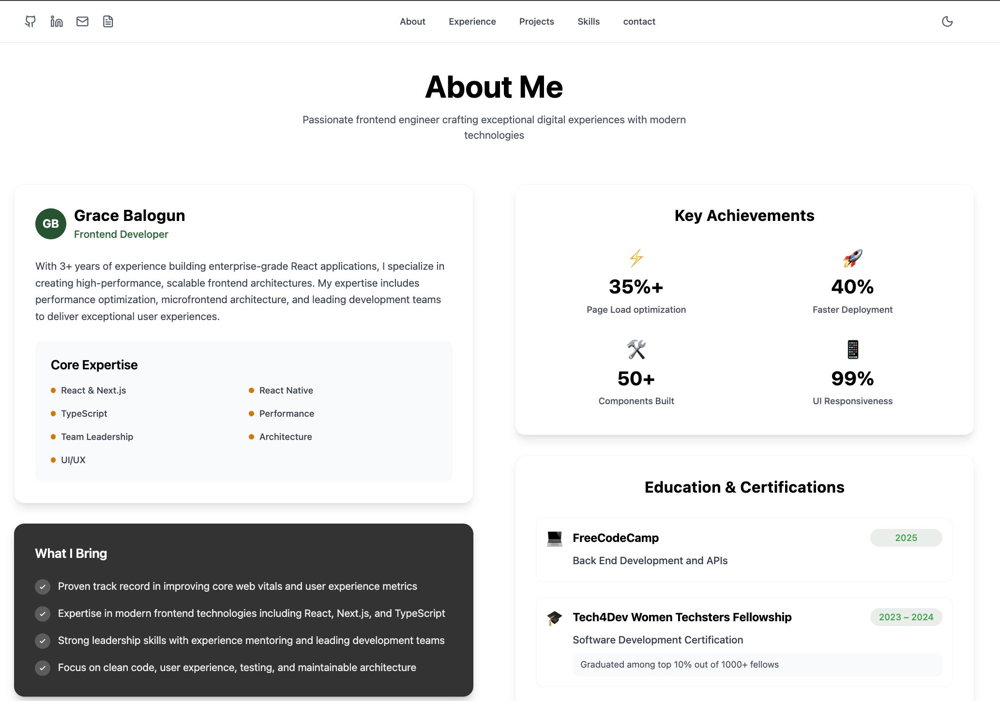
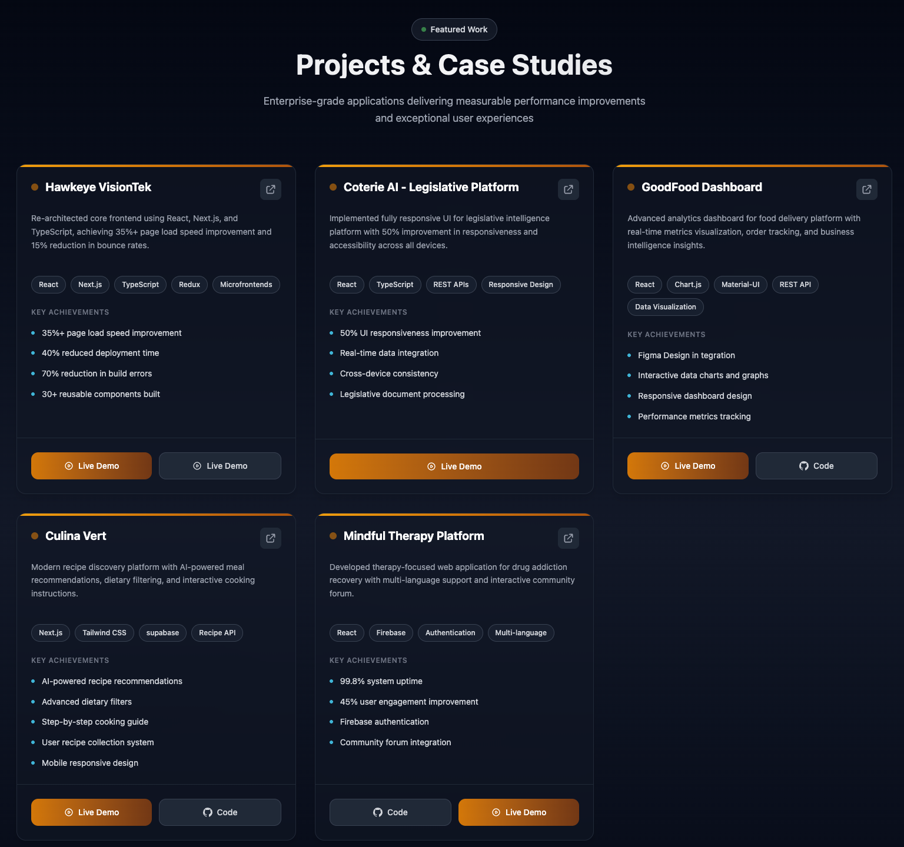
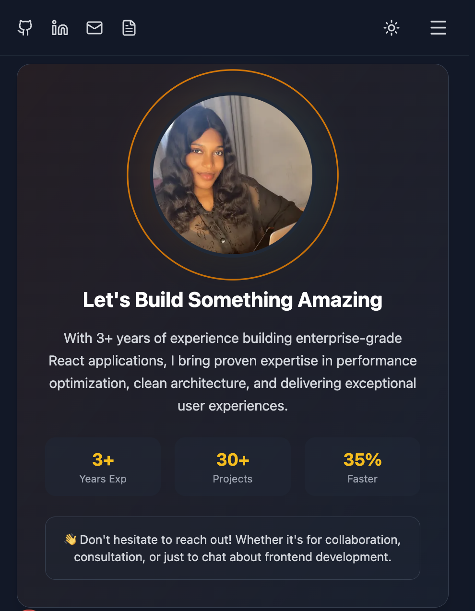

# Grace Balogun — Frontend Developer Portfolio

Professional portfolio website built to showcase my work, skills, and frontend development experience.

🌐 **Live Site:** https://grace-balogun.vercel.app/

---

## Overview

This project is my **personal frontend portfolio**, created to present my background, featured projects, and technical skills in a clean and professional way.

The site is intentionally built as a **frontend-only application** to focus on UI quality, structure, responsiveness, and performance.

---

## What You’ll Find on the Site

- Brief professional introduction
- Featured projects with descriptions
- Core frontend skills and tools
- Contact links for opportunities and collaboration

---

## Tech Stack

- **Next.js** (React framework)
- **JavaScript**
- **Tailwind CSS**
- **Vercel** (deployment)

---

## Screenshots

> Screenshots are stored in `/public/screenshots/`






---

## Local Development

To run this project locally:

```bash
git clone https://github.com/graycepaul/Grace_Balogun.git
cd Grace_Balogun
npm install
npm run dev

Then open:

http://localhost:3000

```
